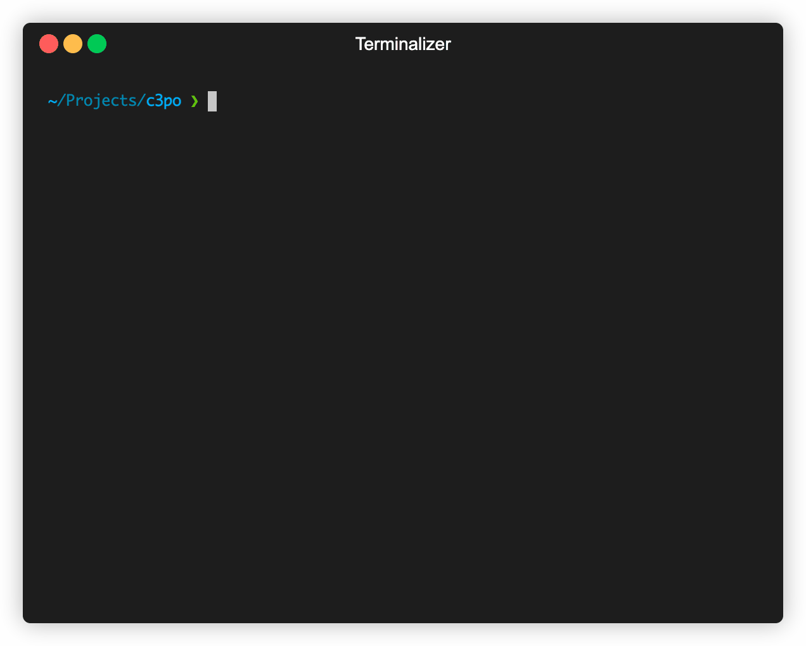

<h1>C3PO - powered by ChatGPT</h1>

English | [简体中文](README_zh.md)

## Introduction

C3PO uses ChatGPT as backend to generate translations for i18n files.



> Introducing C3PO, your ultimate partner in internationalization and translation. C3PO is a powerful i18n translation tool that is here to make your life easier by bridging language barriers and helping you connect with people all over the world. Powered by ChatGPT, C3PO is designed with cutting-edge technology and features that deliver accurate and timely translations in no time. Whether you're a business looking to expand your global reach or an individual simply interested in exploring foreign languages, C3PO has got you covered. With its user-friendly interface and advanced translation capabilities, C3PO is your go-to solution for all your i18n translation needs. Say goodbye to language barriers and hello to a world of opportunities with C3PO.
> 
> -- Generated by ChatGPT

## Installation

### go install

```bash
go install github.com/leslieleung/c3po
```

## Usage

Before using C3PO, you need to have a OpenAI API key. Then you have to set it 
either through `export OPENAI_API_KEY="sk-xxxxxx"` or `echo "sk-xxxxxx" > ~/.c3pocfg`.

### Translate

```bash
c3po translate -t "text to translate" -l "en,de"
```

`-l "en,de"` is the ISO-639-1 language code, divided by comma.

### Translate File

```bash
c3po translateFile -f "path/to/file"
```

Currently only csv format is supported. Your csv file should look like this:

```csv
key,zh,en,de,fr
hello,你好,,,
```

The first line should be the header, the first column should be the key, 
and the second column should be the source language.
Then followed by the target languages.

### Debug

Use any command with `-v` option would set log level to `DEBUG`, should give you enough info to debug with.

## Roadmap

- [ ] support GNU mo/po files
- [ ] stability improvements

## One more thing...

In case you wonder, the prompt I am using is:

```
(for single language)
Translate a i18n locale string to %s. Consider the context of the value to make better translation. Print only the translated string.

(for multiple languages)
Translate a i18n locale string to following languages %s. Consider the context of the value to make better translation. Each line starts with the language name(eg. "it: ciao, mondo"), devide each translation with line break(LF), do not add extra format.
```

The attempt to make ChatGPT output structured data works most of the time, but sometimes it would just add some weird shit to the output.
The best option is simply retry.

## Credits

This project is partially inspired by [chatgpt-i18n](https://github.com/ObservedObserver/chatgpt-i18n) . It provides a web interface to translate i18n files.
However, only json format is supported. I intend to add support to more formats, like GNU mo/po files.